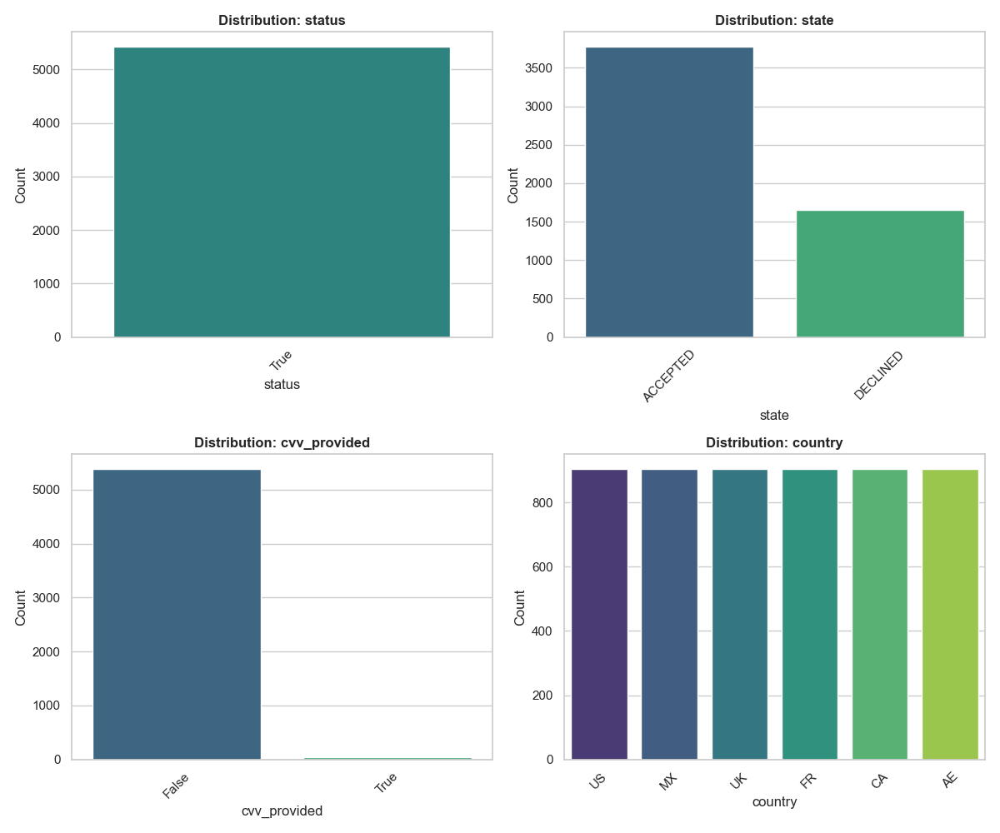
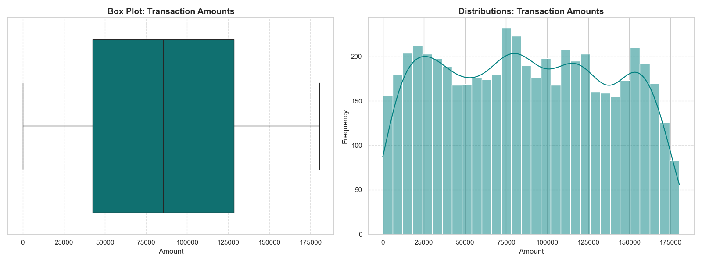
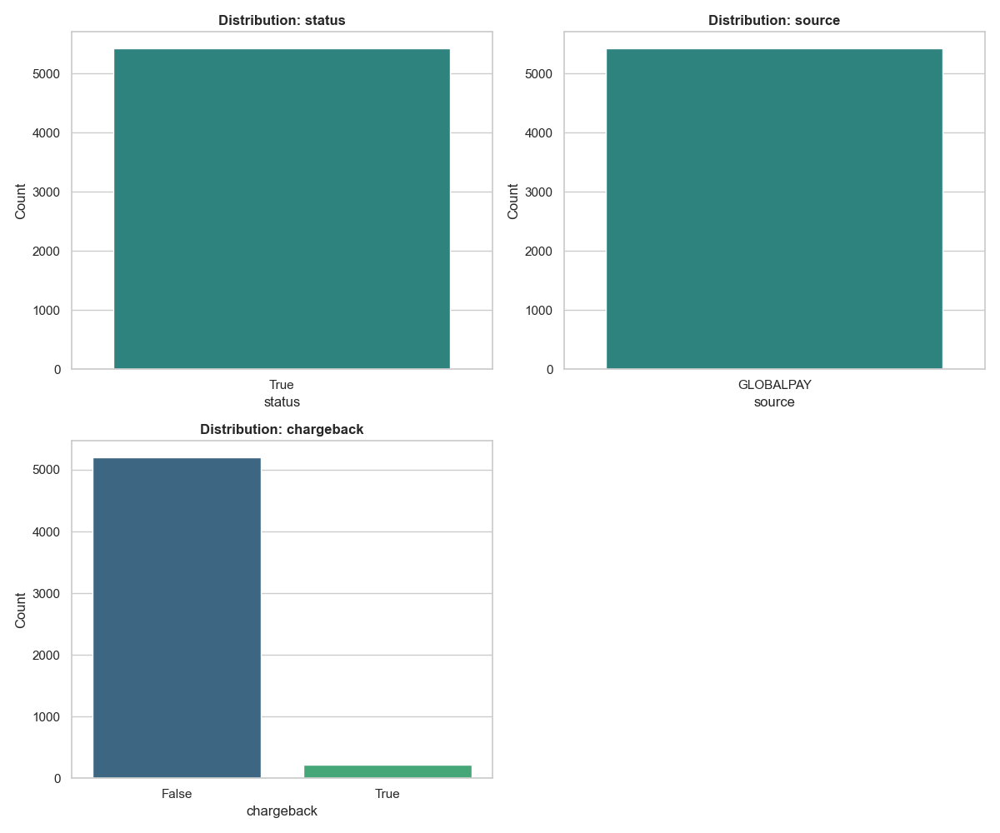
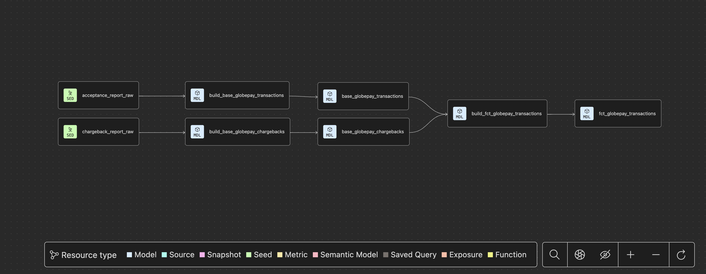
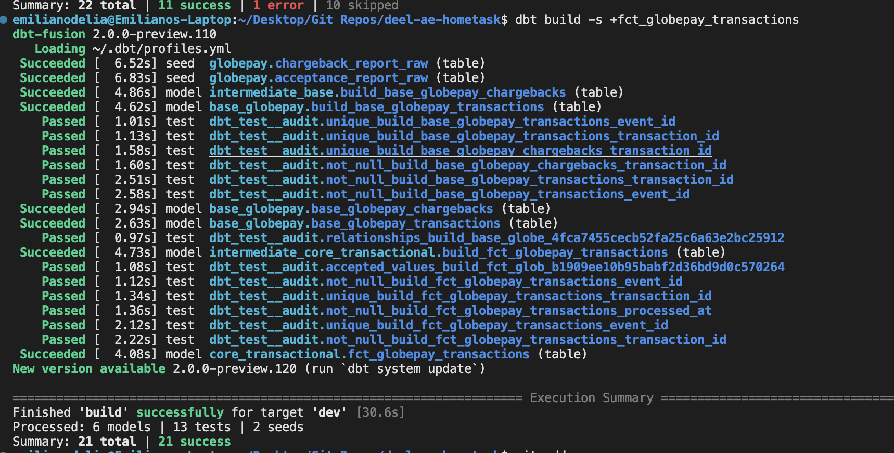
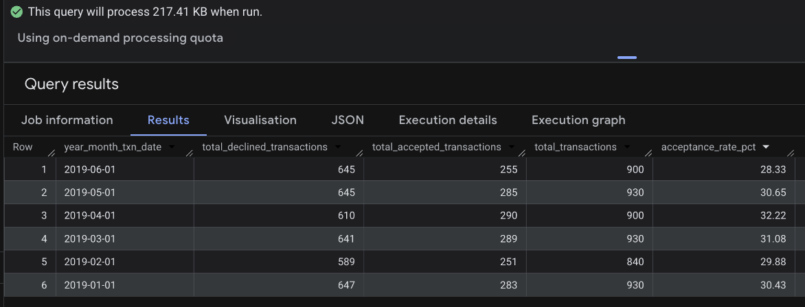
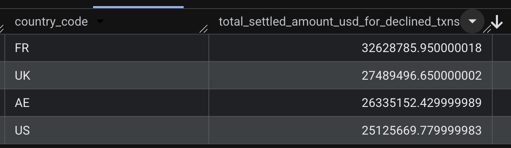
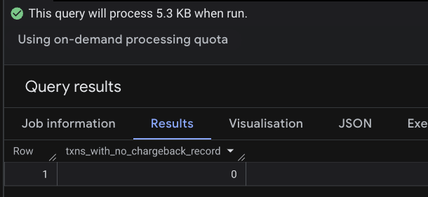

# Deel <> Analytics Engineering Challenge

## Business Context
Deel clients can add funds to their Deel account using their credit and debit cards. Deel has partnered with Globepay to process all of these account funding credit and debit card transactions. Globepay is an industry-leading global payment processor and is able to process payments in many currencies from cards domiciled in many countries.

Deel has connectivity into Globepay using their API. Deel clients provide their credit and debit details within the Deel web application, Deel systems pass those credentials along with any relevant transaction details to Globepay for processing

# `Part I - Data Ingestion and Architecture Design`

## `1. Preliminary Data Exploration`

### Transaction Acceptance Report
notebook path: `analyses/acceptance_rate_eda.ipynb`

```md
Total records: 5430
Total columns: 11

Min transaction date: `2019-01-01T00:00:00.000Z`
Max transaction date: `2019-06-30T19:12:00.000Z`

Duplicate external refs: 0
Duplicate refs: 0
Rows with broken json rates: 0

Nulls per Column
external_ref    0
status          0
source          0
ref             0
date_time       0
state           0
cvv_provided    0
amount          0
country         0
currency        0
rates           0
```






### Chargeback Report

notebook path: `analyses/chargeback_report_eda.ipynb`

```md
Total records: 5430
Total columns: 4

Duplicate external refs: 0

Nulls per Column
external_ref    0
status          0
source          0
chargeback      0
```



### Key Observations
* High reliability: No null or missing values were found in any columns across both datasets.
* All JSON FX rate records look good. No weird formatting or broken records were detected.
* Transactional data only covers 6 months of 2019.
* A consistent universe of 5430 records is maintained across both the acceptance report and the chargeback report.
* Column `status` in both reports looks like a message related to the success of the API call, we can ignore it for now 
* Column `source` (chargebacks) has only one possible value which is GLOBALPAY, useful for differentiating between sources in the case  more payment third parties get integrated in the future but it is not relevant for the task. Ignore for now


## `2. Summary of your model architecture`

The architecture is divided into four standalone layers to ensure scalability, data quality, and clear lineage. 

_Note on Implementation:_ All models in this project were fully materialized within a prersonal BigQuery project

```bash
models
├── seeds/ # csv files / ingestion layer 
│   ├── acceptance_report_raw.csv
│   └── charge_back_report_raw.csv
│
└── models/
    ├── 1_staging/      # Raw data cleaned, cast, and renamed. Materialized as views
    │   ├── _stg_globepay__models.yml
    │   ├── stg_globepay__chargebacks.sql
    │   └── stg_globepay__transactions.sql
    │
    ├── 2_intermediate/   # Business logic and heavy/complex transformation layer. Materialized as views       
    │   ├── _int_globepay__models.yml
    │   └── int_transactions_joined.sql
    │
    └── 3_marts/     # Home of the fct and dim models materialized as tables to procide high performance models for end users            
        └── payment_management
            ├── _marts_payment_management__models.yml
            └── fct_transactions.sql
```

* Materializing the models in both the staging and intermediate layers as views keeps our production schema clean by not physically storing redundant datasets and simplifies the database catalog. Everybody wins


### Description per Layer 

### Layer Descriptions

### `1. Ingestion Layer`
* **Role**: Ingestion of raw transaction acceptance and chargeback data.
* **Action**: Static CSV files are loaded into BigQuery as raw tables
* **Notes**: EDA showed no messy data or broken data formats; however, testing was still applied to ensure data quality at the start of the pipeline.

### `2. Staging Layer`
* **Role**: Cleaning and standardizing.
* **Action**: Creation of views that rename columns, cast timestamps, and standardize the schema.
* **Why**: This layer ensures that if source column names change, the fix only needs to be applied in one place.

### `3. Intermediate Layer`
* **Role**: Business logic integration and core transformations.
* **Action**: This is where the "heavy lifting" occurs, using complex transformations to further refine the data.
* **JSON Processing**:
  * Extracts nested exchange rates from the `rates` column to identify the specific USD rate used in the conversion.
  * **Value**: This allows analysts to reverse-calculate the original local currency amount paid by the customer, providing insight into local price points and consumer behavior otherwise lost in a USD-standardized dataset.
* **Joining & Flag Creation**: Joins transactions with chargebacks and creates the `has_chargeback` and `has_chargeback_evidence` boolean fields.
* **Why**: Keeps complex logic out of the Marts layer to ensure the final tables remain thin and easy to query.

### `4. Marts Layer`
* **Role**: Consumption and reporting at the enterprise or domain level.
* **Action**: Builds the final `fct_transactions` model, capable of answering all defined business questions.
* **Why**: This table is optimized for BI tools and end-users. It is tested for uniqueness and nulls to ensure financial reporting accuracy.

### `Data Limitations & Assumptions`
* **Assumption on Chargeback Status**: Although the current acceptance and chargeback reports share a perfect 1:1 mapping, I have introduced a boolean validation field to identify any transactions missing a corresponding chargeback record. The field `has_chargeback_evidence` will let the analysts filter any transaction with missing chargeback data and avoid dealing with nulls within the BI tool to be used by the analyst

## 3. Lineage graphs

The graph below shows the flow from raw seeds to the final fact table.



## `4. Tips around macros, data validation, and documentation`

### Data Quality and Validations
* **Uniqueness and Not-Null**: Applied to `transaction_id` and `external_ref` across both the Staging and Marts layers. These tests ensure no duplicates are generated during joins, preventing the distortion of critical financial metrics.
* **Relationships**: Used to guarantee that 100% of the IDs in the `chargeback_report` exist within the `acceptance_report`, ensuring referential integrity.
* **Accepted Values**: Used to validate that categorical fields (such as `state`) fall within the expected set of values defined in the source data

### Documentation
* YML descriptions were included for every model and column, and I ensured that this information was transferred to the materialized models in BigQuery.
* CTEs are key to making the transformation steps easy for anyone to follow. In my day-to-day, I welcome the inclusion of comments within the code. Our enterprise-level repository has many collaborators, therefore, it is always helpful to be able to pick up where someone left off with clear context and logic explanations.
* The project is fully compatible with `dbt docs generate`, which provides a searchable data catalog for anyone who needs or wants to check lineages or data flows. Not everyone wants to clone a repo and research from the inside, so this UI is quite helpful.
* **Hot Tip!** To avoid copy/pasting column names repeatedly across every layer, a markdown file can be created to centralize all common column definitions and assign them where needed. Initially, I avoided using this in the repo because I assumed you wanted to see the definitions in the YML files themselves rather than in a separate document

Example

md file would look like this 
```md

The unique transaction identifier generated by the Globepay API. 
This is the primary join key across all Globepay reports.



The final business outcome of the payment attempt. 
Common values include `ACCEPTED`, `DECLINED`, or `ERROR`.

```

YML files would look like this 

```yml
version: 2

seeds:
  - name: chargeback_report_raw
    columns:
      - name: external_ref
        description: "{{ doc('external_ref') }}" # <--- Pulls from the .md file

models:
  - name: stg_globepay__transactions
    columns:
      - name: external_ref
        description: "{{ doc('external_ref') }}"
      - name: state
        description: "{{ doc('transaction_state') }}"
```

# `Part II - Final Model Testing`
For the second part of the challenge, please develop a production version of the model for the
Data Analyst to utilize. This model should be able to answer these three questions at a
minimum

Final Model -----> `fct_transactions`

dbt build ran as expected, all good 

```sql
dbt build -s +fct_transactions
```



----------------------------------------

1. What is the acceptance rate over time?

```sql
with calculations as (
  select 
    extract(year from processed_at) as year,
    extract(month from processed_at) as month_num,
    format_timestamp('%B', processed_at) AS month,
    sum(case when status='DECLINED' then 1 else 0 end)  as total_declined_transactions, 
    sum(case when status='ACCEPTED' then 1 else 0 end) as total_accepted_transactions,
    count(transaction_id) as total_transactions
  from deel-task-12345.payment_management.fct_transactions 
  group by all 
)

select 
  *except(month_num), 
  round(safe_divide(total_accepted_transactions, total_transactions)*100, 2) as acceptance_rate_pct
from calculations
order by year, month_num asc
```



----------------------------------------

2. List the countries where the amount of declined transactions went over $25M
```sql
with declined_transactions_scope as (
  select 
    country_code, 
    sum(settled_amount_usd) as total_settled_amount_usd_for_declined_txns
  from deel-task-12345.payment_management.fct_transactions 
  where status='DECLINED'
group by country_code 
)

select * from declined_transactions_scope 
where total_settled_amount_usd_for_declined_txns>25000000
```



----------------------------------------

3. Which transactions are missing chargeback data?

```sql
select count(*) as txns_with_no_chargeback_record
from deel-task-12345.payment_management.fct_transactions 
where has_chargeback_evidence=false
```


